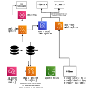

# Design of a REST API for Curricular data

See the [implementation](https://github.com/baranasoftware/curricular-api) for this design. 

Feel free to reach us at contact@baranasoftware.com to see how we can collaborate in your API design and implementation effort.

## System Design

## Design Notes
* __Problem statment__: Provide a mechanishm to access to data from Student Information System (SIS) and a Data Warehouse (DW)
that contains historical data, in a developer friendly manner. SIS stores data in very vendor specific format and by providing a RESTful API, consumers will 
be able to consume data easily without the need to know vendor specific constructs.
* Updates are made to SIS record every night. Then throughout the day updates are done into a selected set of records (for e.g. number of open seats in a class).
* SIS may not be able to handle large number of transactions per second (TPS) requirements from users. So a copy of 
  static data will be bundle into the API, so that a large number of concurrent users (~400K TPS) can consume those data.
* AWS cost is a design parameter. To avoid accumulating considerable amount of AWS bills, SQLite was selected as the data source inside the API.
* SQLite works well in a situation where there is a write-once, read-many type of workload.
* Static data is merged with real-time updates (stored inside an AWS DynamoDB table) to produce the response for client requests.
* Client can request either `JSON` or `XML` data formats. The backend decide which data format to use based on `Content-Type` header.
* Every night `AWS CloudWatch` event execute an ECS task that builds SQLite files and upload to S3 bucket.
* A scheduled GitLab pipeline fetch the SQLite files, build Docker images with binaries (written in Go langauge) and deploy to `AWS ECS`.
* Real time updates are fetched from `SIS` and uses records as described in the changelog table. The real time update `AWS Lambda` runs 
more frequently to fetch records from `SIS`. 
* The change log table is an Oracle AUDIT table. In order to create an audit log for changes: auditing on the table should be enabled.
  This [guide](https://stackoverflow.com/questions/72319748/what-is-changelog-column-in-oracle-db) describe that process. This integration can further be improved by 
 [using Java](https://docs.oracle.com/en/database/oracle/oracle-database/23/jjdev/calling-Java-from-database-triggers.html#GUID-5C498DEF-0348-484D-AA26-2A88EF348D5C) code sends updates to a `AWS SQS` queue directly.
 That will further improve the realtime updates latency.
* Real time updates are then persisted into a `AWS DynamoDB` table. 
* Then requests are served through an `AWS ALB`. When a request is received first the `AWS DynamoDB` table is checked to see if updates are available for the overnight build (SQLite).
  If there are updates, those data is merged from the data from `SQLite` files and client request is served. A timestamp is used to determine 
  if there are updates to a data element/record (timestamp in `SQLite` for last updated is compared with timestamp in `AWS DynamoDB` table).

