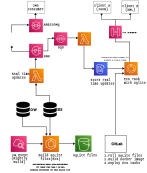

# Design of a REST API for Curricular data

See the [implementation](https://github.com/baranasoftware/curricular-api) for this design. 

Feel free to reach us at contact@baranasoftware.com to see how we can collaborate in your API design and implementation effort.

## System Design

## Design Notes
* Problem statment: Provide a RESTful API to provide access to data from Student Information System (SIS) and a Data Warehouse (DW)
that contains historical data. SIS stores data in very vendor specific format and by providing a RESTful API consumers will 
be able to consume data easily without the need to know vendor specific constructs.
* Updates are made to SIS record every night. Then throughout the day updates are done into a selected set of records (for e.g. number of open seats in a class).
* SIS may not be able to handle large number of transactions per second (TPS) requirements from users. So a copy of 
  static data will be bundle into the API, so that a large number of concurrent users (~400K TPS) can consume those data.
* AWS cost is a design parameter. To avoid accumulating considerable amount of AWS bills, SQLite was selected as the data source inside the API.
* SQLite works well in a situation where there is a write-once, read-many type of workload.
* Static data is merged with real-time updates (stored inside an AWS DynamoDB table) to produce the response for client requests.
* Client can request either `JSON` or `XML` data formats. The backend decide which data format to use based on `Content-Type` header.
* 

